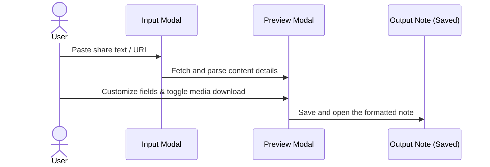
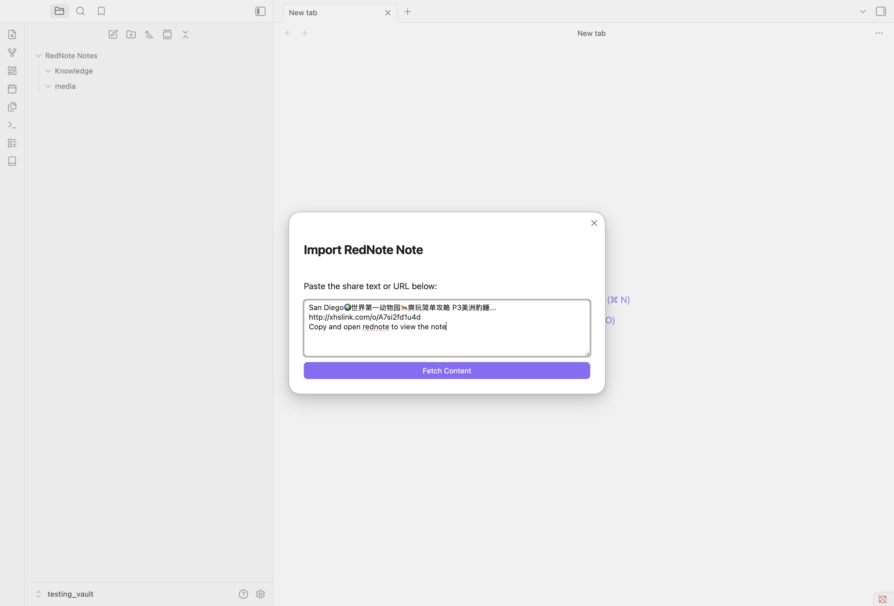
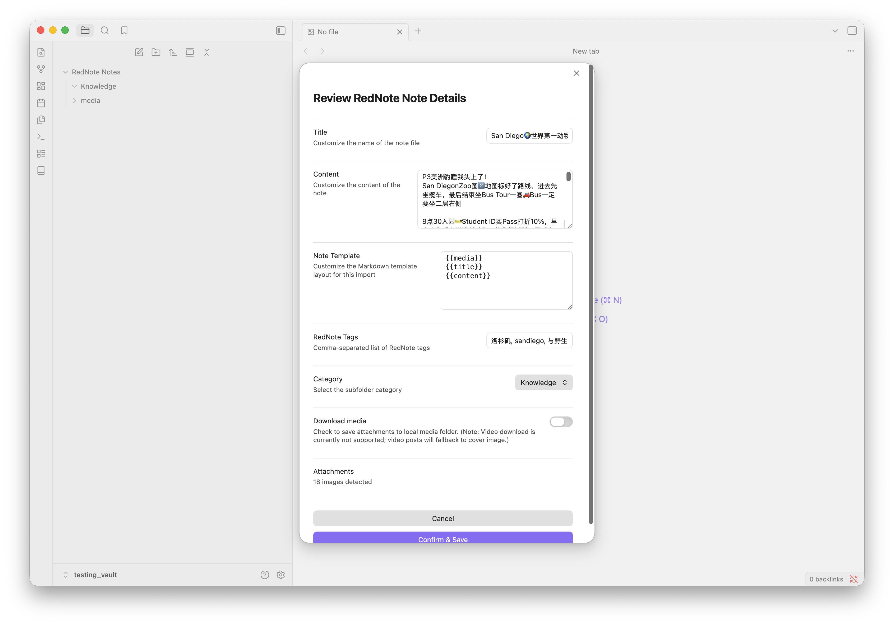

# RedNote / Xiaohongshu Importer for Obsidian

An Obsidian plugin to scrape, parse, and import RedNote and Xiaohongshu (小红书) posts directly into your Obsidian vault as Markdown notes, with support for media downloads and categorizations.

## How it Works

The flow below illustrates how a RedNote link is processed and converted into a formatted note in your vault:



---

## Import Workflow Screenshots

Below is a step-by-step preview of the import process using the plugin:

### Step 1: Input Modal
Paste the shared link or text containing the link to start fetching.


### Step 2: Preview & Customize
Review the parsed title, content, template layout, category, and toggle local media download.


### Step 3: Saved Markdown Note
The scraped content is formatted according to the template with all tags and local media embedded.


---

## Features

- **RedNote & Xiaohongshu Support**: Handles links from both `xiaohongshu.com` and `rednote.com` domains, as well as `xhslink.com` mobile short links.
- **URI Protocol Handler**: Trigger imports from outside Obsidian via the `obsidian://rednote-import` protocol link. Excellent for iOS Shortcuts or Tasker on Android.
- **Media Download Support**: Automatically download images locally into a dedicated media subfolder. *Note: Currently supported media does not include video files (video posts will fallback to cover image or keep the remote video link).*
- **Filename Collision Protection**: If a note with the same title already exists, the plugin automatically resolves the filename by appending `-1`, `-2`, etc., avoiding data overwrite.
- **Decoupled API**: Exposes a clean, public API for integration with centralized link dispatchers or scripting plugins (like Templater or QuickAdd).

---

## Usage

### 1. Manual Import
1. Click the ribbon icon (book) or run the command `Import RedNote Note` from the command palette.
2. Paste the shared link or text containing the link.
3. Select a category and toggle media downloads if desired.
4. Press **Import**.

### 2. Mobile / Protocol Trigger
You can open the following URI on your mobile device (e.g. from an iOS Shortcut share action) to trigger a background import:
```text
obsidian://rednote-import?url=<REDNOTE_URL>&category=<CATEGORY>&downloadMedia=true
```

## Templates & Placeholders

You can customize the structure of your note body and frontmatter properties in the settings tab. 

### Available Placeholders:
- `{{title}}`: The title of the post (hashtags removed).
- `{{content}}`: The post body content description.
- `{{media}}`: Note media block (HTML video element, or Markdown images list). When used inside YAML properties, it renders the raw media path/URL (useful for `cover:` or `thumbnail:` fields).
- `{{source}}` / `{{url}}`: The source RedNote link.
- `{{date}}`: Current date in YYYY-MM-DD format.
- `{{category}}`: The selected note category.

### Default Markdown Template:
```
{{media}}
{{title}}
{{content}}
```

## Known Issues

- **Media Timeout Fallback**: If media file downloads time out (due to slow network connections exceeding the 10-second threshold), the note creation will fall back to using the raw remote URLs for those media assets instead of local paths. This ensures the note is always successfully saved.
- **Video Downloads**: Local video file downloading is currently not supported; video posts will fall back to displaying the cover image or use remote video links.

---

## Developer Documentation

### Public API Contract
Other plugins can access the scraper and importer functionality directly:
```typescript
const rednotePlugin = app.plugins.plugins["rednote"];
if (rednotePlugin && rednotePlugin.api) {
    const text = "Check out http://xhslink.com/o/2Bi7K3Cxa3q";
    const url = rednotePlugin.api.extractURL(text);
    if (url) {
        // targetFile is optional. If provided, the plugin overwrites and renames it.
        await rednotePlugin.api.importNote(url, "Food", true, targetFile);
    }
}
```

### Installation & Local Deployment
To run and install the plugin in your local Obsidian vault:
1. Clone this repository anywhere on your system.
2. Create your local environment configuration file:
   ```bash
   cp .env.example .env
   ```
3. Open `.env` and set `OBSIDIAN_VAULT_PATH` to the absolute path of your Obsidian vault.
4. Install dependencies:
   ```bash
   npm install
   ```
5. Build and deploy the plugin to your vault:
   ```bash
   npm run install-local
   ```

